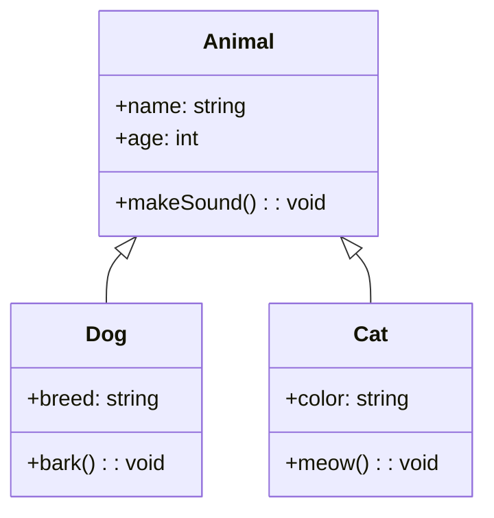
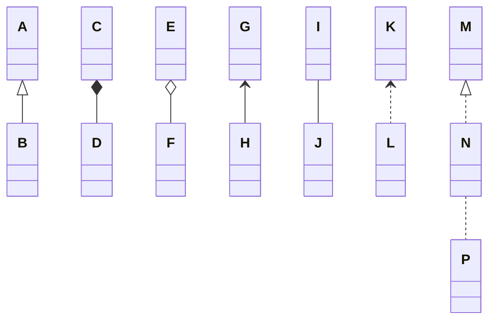

```mermaid
classDiagram
    class Animal {
        +name: string
        +age: int
        +makeSound(): void
    }

    class Dog {
        +breed: string
        +bark(): void
    }

    class Cat {
        +color: string
        +meow(): void
    }

    Animal <|-- Dog
    Animal <|-- Cat
```

```mermaid
classDiagram
    A <|-- B
    C *-- D
    E o-- F
    G <-- H
    I -- J
    K <.. L
    M <|.. N
    N .. P
```