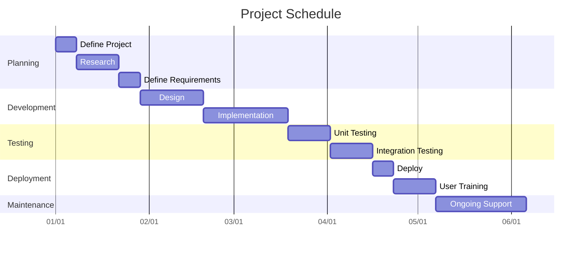

```mermaid
gantt
    title Project Schedule
    dateFormat YYYY-MM-DD
    axisFormat %m/%d

    section Planning
    Define Project : 2023-01-01, 7d
    Research : 2023-01-08, 14d
    Define Requirements : 2023-01-22, 7d

    section Development
    Design : 2023-01-29, 21d
    Implementation : 2023-02-19, 28d

    section Testing
    Unit Testing : 2023-03-19, 14d
    Integration Testing : 2023-04-02, 14d

    section Deployment
    Deploy : 2023-04-16, 7d
    User Training : 2023-04-23, 14d

    section Maintenance
    Ongoing Support : 2023-05-07, 30d


```