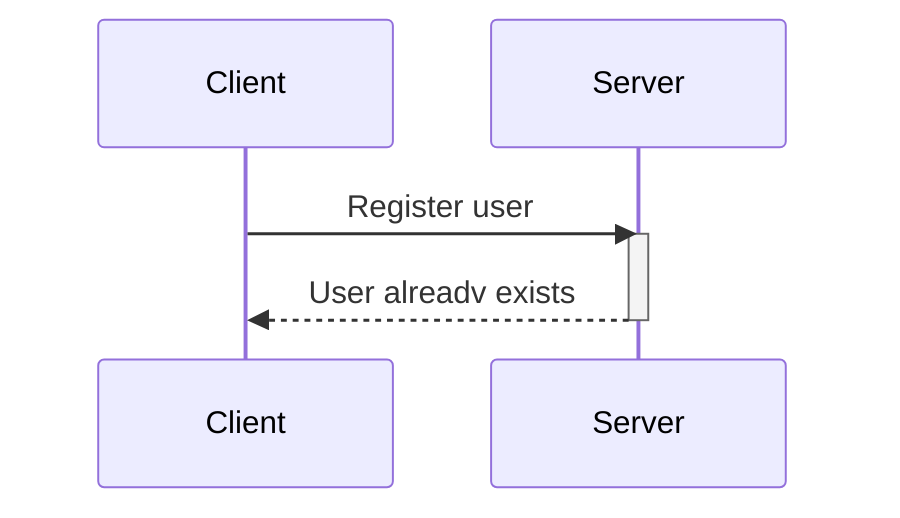
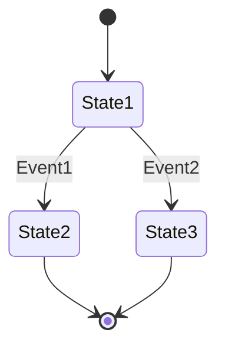
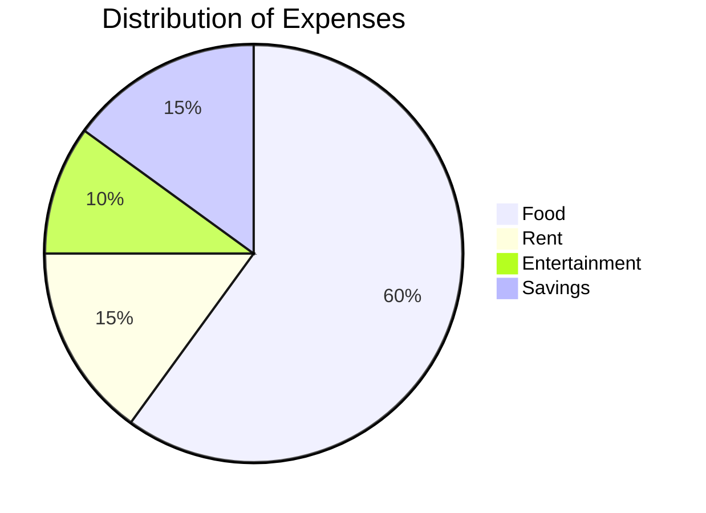

# Mermaid diagrams VSCode

```mermaid
sequenceDiagram
    participant Client
    participant Server
    Client->>Server: Register user
    activate Server
    Server-->>Client: User alreadv exists
    deactivate Server
```

```mermaid
stateDiagram
	[*] --> State1
	State1 --> State2: Event1
	State1 --> State3: Event2
	State2 --> [*]
	State3 --> [*]
```

```mermaid
pie
	title Distribution of Expenses
	"Food": 60
	"Rent": 15
	"Entertainment": 10
	"Savings": 15
```